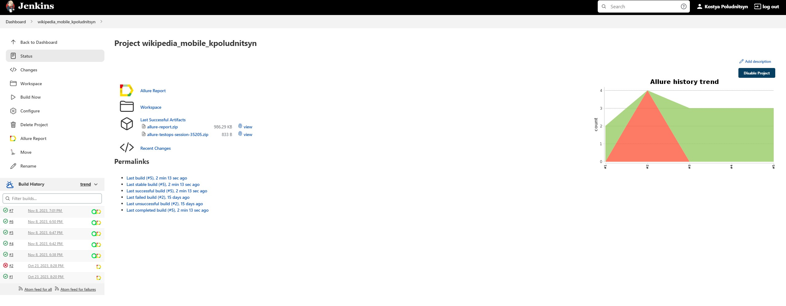
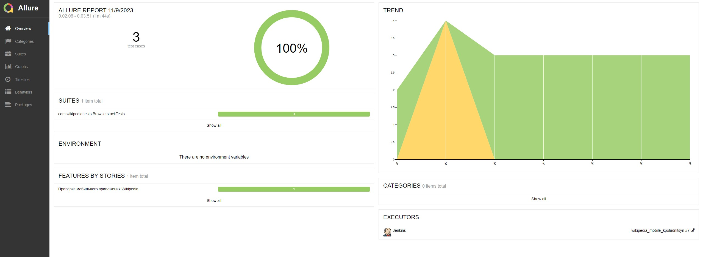
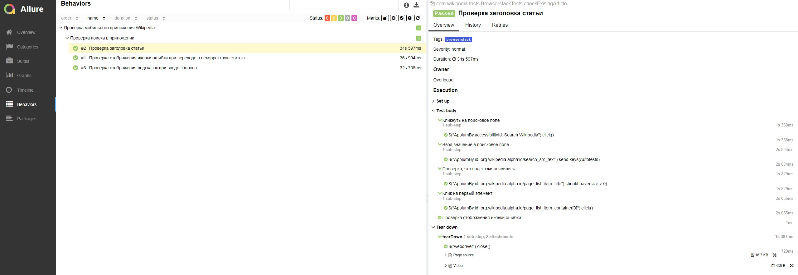
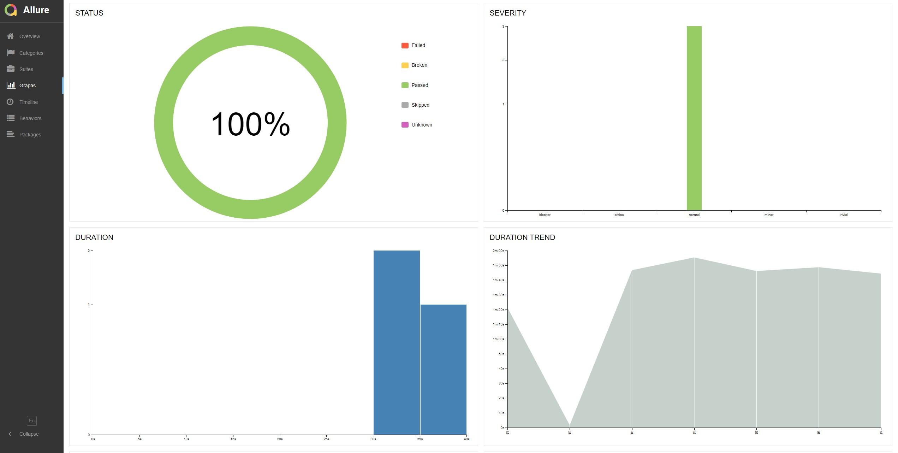
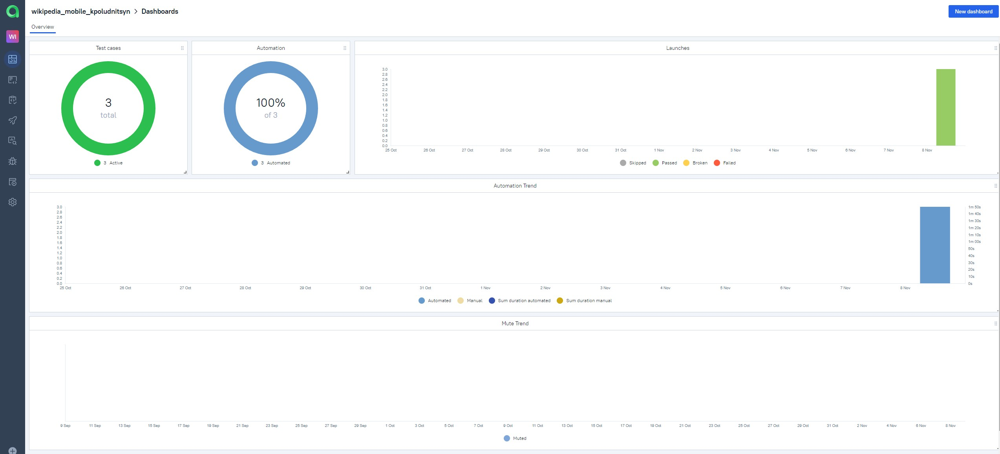
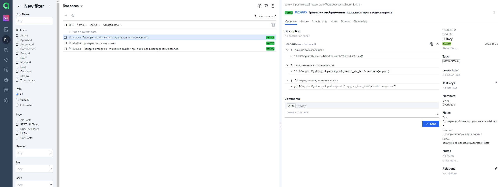
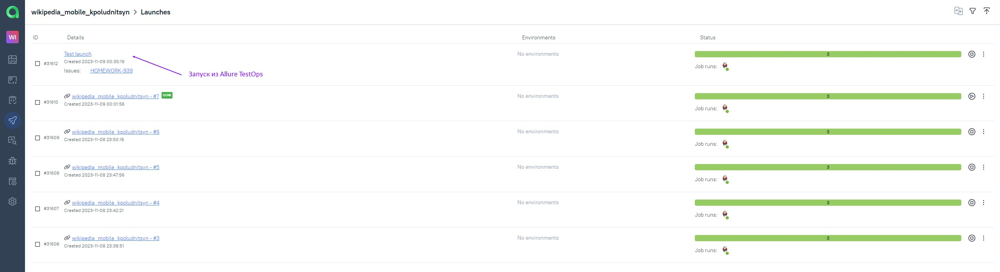
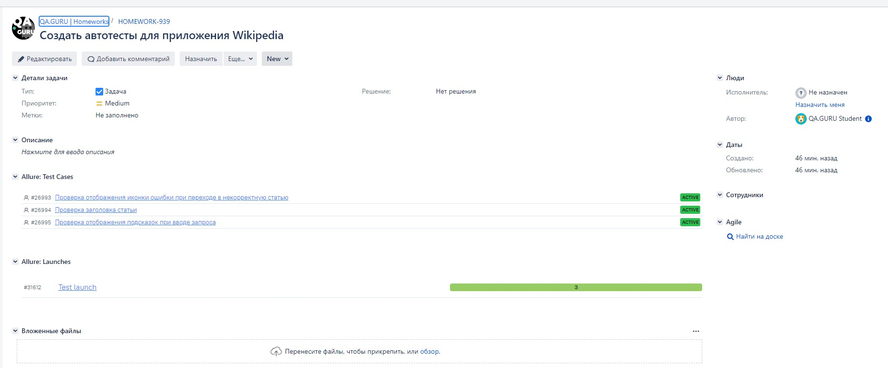
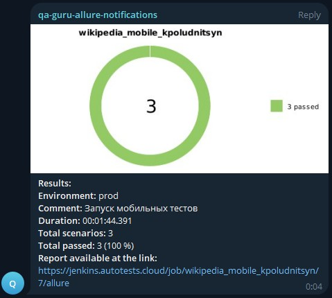

# Проект по автоматизации mobile тестов для приложения [Wikipedia](https://ru.wikipedia.org/)
<p align="center"><a href="https://www.tinkoff.ru"></a></p>  

> Википедия - общедоступная многоязычная универсальная интернет-энциклопедия со свободным контентом, реализованная на принципах вики.

## :notebook: Содержание:

- [Стек технологий](#computer-стек-технологий)  
- [Тестовые сценарии](#clipboard-тестовые-сценарии)
- [Сборка в Jenkins](#-сборка-в-jenkins)
- [Команды для запуска](#rocket-команды-для-запуска)
- [Allure отчет](#-allure-отчет)
- [Интеграция с Allure TestOps](#-интеграция-с-allure-testops)
- [Интеграция с Jira](#-интеграция-с-jira)
- [Уведомления в Telegram чат с ботом](#-уведомления-в-telegram-чат-с-ботом)
- [Видео запуска тестов в Selenoid](#-видео-запуска-тестов-в-selenoid)  

---

## :computer: Стек технологий
<p align="center">
<a href="https://www.java.com/"></a>
<a href="https://www.jetbrains.com/idea/"></a>
<a href="https://www.github.com/"></a>
<a href="https://www.gradle.org/"></a>
<a href="https://www.junit.org/junit5/"></a>
<a href="https://www.selenide.org/"></a>
<a href="https://appium.io/"></a>
<a href="https://www.browserstack.com/"></a>
<a href="https://www.aerokube.com/selenoid/"></a>
<a href="https://www.jenkins.io/"></a>
<a href="https://github.com/allure-framework/allure2"></a>
<a href="https://www.qameta.io/"></a>
<a href="https://www.atlassian.com/software/jira"></a>
<a href="https://www.telegram.org/"></a>
</p>

---

## :clipboard: Тестовые сценарии

### Для локального запуска
- :white_check_mark: Проверка стартовых страниц wiki
- :white_check_mark: Проверка компонента "Saved"
- :white_check_mark: Проверка добавления статьи в компонент "Saved"
- :white_check_mark: Проверка компонента "More"

### Для удаленного запуска
- :white_check_mark: Проверка отображения подсказок при вводе запроса
- :white_check_mark: Проверка отображения иконки ошибки при переходе в некорректную статью
- :white_check_mark: Проверка заголовка статьи

---

##  Сборка в [Jenkins](https://jenkins.autotests.cloud/job/wikipedia_mobile_kpoludnitsyn/)

<p align="center">

</p>

---

## :rocket: Команды для запуска

### Локальный запуск (через эмулятор)

```bash
gradle clean local_test -Dhost=local
```

> Для запуска локальных тестов требуются следующие установленные программы на компьютере: Appium Server, Appium и Android Studio

### Удаленный запуск (через browserstack)

```bash
gradle clean browserstack_test -Dhost=browserstack
```

---

##  [Allure](https://jenkins.autotests.cloud/job/wikipedia_mobile_kpoludnitsyn/allure/) отчет

### Главная страница отчета

<p align="center">

</p>

### Тест-кейсы

<p align="center">

</p>

#### Содержание тест-кейсов

- :heavy_check_mark: Подробное описание шагов
- :heavy_check_mark: Тег
- :heavy_check_mark: Эпик
- :heavy_check_mark: Критичность теста
- :heavy_check_mark: Автор
- :heavy_check_mark: Разметка в приложении
- :heavy_check_mark: Видео с прохождением теста

### Графики

<p align="center">

</p>

---

##  Интеграция с [Allure TestOps](https://allure.autotests.cloud/project/3764/dashboards)

### Dashboard

<p align="center">

</p>

### Автоматизированные тест-кейсы

<p align="center">

</p>

### Запуск сборки из **Allure TestOps**

<p align="center">

</p>

---

##  Интеграция с [Jira](https://jira.autotests.cloud/browse/HOMEWORK-939)

### Задача в Jira

<p align="center">

</p>

#### Содержание задачи

- :heavy_check_mark: Тест-кейсы из Allure TestOps
- :heavy_check_mark: Результат прогона тестов в Allure TestOps

---

##  Уведомления в Telegram чат с ботом

### Уведомление через чат бот

<p align="center">

</p>


#### Содержание уведомления в Telegram

- :heavy_check_mark: Окружение
- :heavy_check_mark: Комментарий
- :heavy_check_mark: Длительность прохождения тестов
- :heavy_check_mark: Общее количество сценариев
- :heavy_check_mark: Процент прохождения тестов
- :heavy_check_mark: Ссылка на Allure отчет

---

##  Видео запуска тестов в Selenoid

<p align="center">

</p>
